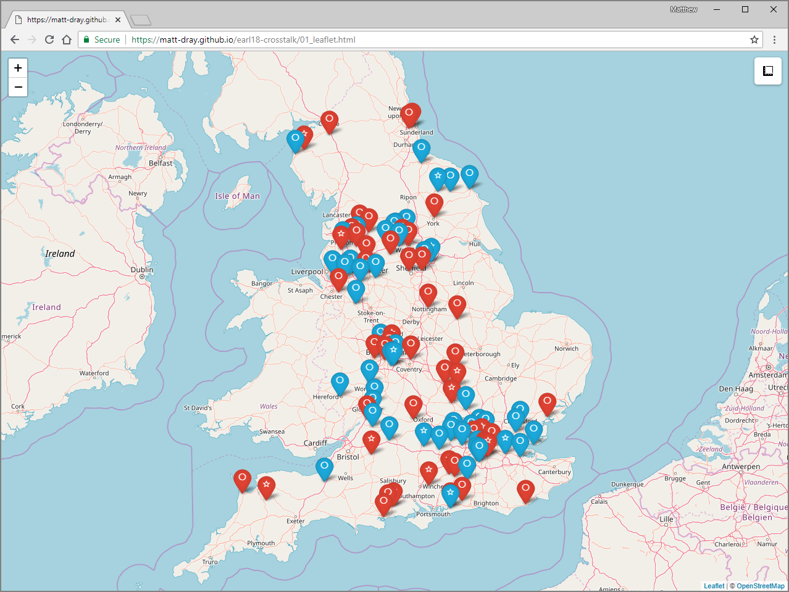

```{r setup, include=FALSE}
options(htmltools.dir.version = FALSE)
```

class: center, middle

# TL;DR

Crosstalk for small, lightweight, shareable apps

---

class: center, middle

# The ask

--

visualise school locations to help make a decision

--

with little infrastructure

--

at low cost

--

at short notice

--

and it has to be shareable

---

class: inverse, center, middle

# Solution 0

GIS software

---

# Solution 0

.pull-left[

## &check;

typical

powerful

shareable output

]

--

.pull-right[

## &cross;

$$$

admin rights

click click click

static

ping-pong feature requests

limited skill transferability

already a backlog

]

---

class: inverse, center, middle

# Solution 1

`leaflet` interactive map

Demo available [here](https://matt-dray.github.io/earl18-crosstalk/01_leaflet.html)

---

class: center, middle

.image-100[]

---

class: center, middle

.image-100[]

---

# Solution 1

.pull-left[

## &check;

interactive

reproducible

simple

shareable

]

--

.pull-right[

## &cross;

separate documentation

separate tabular data

rendered in-browser

]

---
class: inverse, center, middle

# Solution 2

`leaflet` interactive map
<p>in a `flexdashboard`

Demo available [here](https://matt-dray.github.io/earl18-crosstalk/02_leaflet-flexdash.html)

---

class: center, middle

.image-100[]

---

# Solution 2

.pull-left[

## &check;

map + documentation

user-friendly

self-service

]

--

.pull-right[

## &cross;

]

---
class: inverse, center, middle

# Solution 3

`leaflet` interactive map
<p>in a `flexdashboard`
<p>with a `datatable`

Demo available [here](https://matt-dray.github.io/earl18-crosstalk/03_leaflet-flexdash-dt.html)
---

class: center, middle

.image-100[]

---

class: center, middle

.image-100[]

---

# Solution 3


.pull-left[

## &check;


map + documentation + tabular

download data

]

--

.pull-right[

## &cross;

data copies

]

---
class: inverse, center, middle

# Solution 4

`leaflet` interactive map
<p>in a `flexdashboard`
<p>with a `datatable`
<p>and linked with `crosstalk`

Demo available [here](https://matt-dray.github.io/earl18-crosstalk/04_leaflet-flexdash-dt-crosstalk.html)

---

class: center, middle

.image-100[]

---

class: center, middle

.image-100[]

---

class: center, middle

.image-100[]

---

class: center, middle

.image-100[]

---

class: center, middle

.image-100[]

---

class: center, middle

.image-100[]

---

# Solution 4

.pull-left[

## &check;

one data source

selections affect all widgets

filtering

]

--

.pull-right[

## &cross;

?

]

---
class: inverse, center, middle

# What's Crosstalk?

---

# Create *shared data*

```{r eval=FALSE}
data <- readRDS("data/data.RDS")
sd <- SharedData$new(my_data)  #<<
```
--
```{r eval=FALSE}
datatable(sd) #<<
```
--
```{r eval=FALSE}
leaflet(sd) %>%  #<<
  addTiles() %>% 
  addMarkers()
```

---
class: center, middle

# TL;DR

Insert TL;DR.

---
class: inverse, center, middle

# Contact

Matt Dray

[matthew.dray@education.gov.uk](mailto:matthew.dray@education.gov.uk)

[rostrum.blog](https://rostrum.blog) | [twitter.com/mattdray](https://www.twitter.com/mattdray) | [github.com/matt-dray](https://www.github.com/matt-dray)