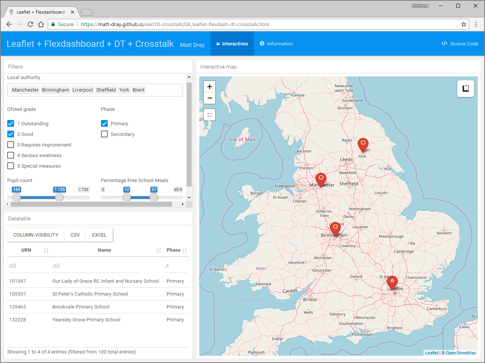

```{r setup, include=FALSE}
options(htmltools.dir.version = FALSE)
```

class: center, middle, inverse

# Crosstalk `r icon::fa("comments")`

### Shiny-like without Shiny

.image-30[]

### Matt Dray | Dept for Education | #EARL2018

???

Shiny is a popular topic at EARL and it solves lots of business problems.

Let's say you're building a small app or doing a mock-up but your infrastructure is limited, or you simply don't need the full extent of Shiny? What other R-based options are there? 

I'm going to talk about one option for doing this.

Hands up if you've used Shiny.

Hands up if you've heard of Crosstalk before.

Hands up if you've used Crosstalk before.

---
class: center, middle

# TL;DR&ast;

Need to create a small interactive app without a server or Shiny?

Try the [`crosstalk`](http://rstudio.github.io/crosstalk/) package.

.footnote[

&ast;Too long; didn't read

]

???

If you're already bored, then just note down this TL;DR. You can go to sleep now.

---
class: center, middle

# Am I talking about a real policy?

Nope, sorry.

Schools in this example were chosen randomly.

???

The content of this talk does not reflect or constitute official government policy.

The data are from published sources.

---
class: center, middle

# The ask

Visualise school locations to help make a policy decision

--

Shareable

--

Cheap

--

Quick

--

Reusable

???

Area-based programmes operate at DfE all the time.

Typically we produce static maps.

ArcMap is not viable. We don't have the licenses.

I iterated over four steps to produce something that my users wanted.

(Or rather didn't even know they wanted.)

And how the `crosstalk` package greatly improved the product.

---
class: inverse, center, middle

# Solution 1

[`leaflet`](https://rstudio.github.io/leaflet/) interactive map

---
class: center, middle

.image-100[]

Demo available [here](https://matt-dray.github.io/earl18-crosstalk/01_leaflet.html)

???

Leaflet is an htmlwidget. It wraps a JavaScript visualisation in R code.

There are other widgets: plotly, DT, etc (https://www.htmlwidgets.org/).

This is a simple example. Each point is a school. You can conditionally change the colour or style of markers.

The output here is HTML, so can be shared easily as a file via email and opened with the user's browser. 

I've also hosted each of the examples in this presentation via GitHub. See the address bar or click the link.

---

class: center, middle

.image-100[]

Demo available [here](https://matt-dray.github.io/earl18-crosstalk/01_leaflet.html)

???

It operated intuitively for our users, who were used to things like Google Maps.

Pan, zoom, select markers to show pop-ups.

You can add things like measuring tools, which is the function provided by the button in the top right.

---
class: center, middle

# Solution 1

.pull-left[

`r icon::fa("check", size = 2)`

interactive

intuitive

]

--

.pull-right[

`r icon::fa("arrow-right", size = 2)`

documentation

]

---
class: inverse, center, middle

# Solution 2

[`leaflet`](https://rstudio.github.io/leaflet/) interactive map

in a [`flexdashboard`](https://rmarkdown.rstudio.com/flexdashboard/)

---
class: center, middle

.image-100[]

Demo available [here](https://matt-dray.github.io/earl18-crosstalk/02_leaflet-flexdash.html)

???

Flexdashbaord allows you to build a framework using R Markdown where you put visualisations, commentary, etc.

Typically you use this for creating dashboards. You can control the layout and style.

So now we have space to put documentation for users (how to, purpose, contact info, etc).

I've also added a source code button for fellow analysts to see and adapt the code.

---
class: center, middle

# Solution 2

.pull-left[

`r icon::fa("check", size = 2)`

documentation

self-service

]

???

'Self-service' meaning that we don't need to be in the room while users explore the data themselves.

--

.pull-right[

`r icon::fa("arrow-right", size = 2)`

tabular data

searchable

]

???

Users were pleased but still had some issues.

How can we add more info into the pop-ups without overloading? Maybe some kind of table.

How can they search for specific schools?

---
class: inverse, center, middle

# Solution 3

[`leaflet`](https://rstudio.github.io/leaflet/) interactive map

in a [`flexdashboard`](https://rmarkdown.rstudio.com/flexdashboard/)

with a [`DT`](https://rstudio.github.io/DT/) interactive table


---
class: center, middle

.image-100[]

Demo available [here](https://matt-dray.github.io/earl18-crosstalk/03_leaflet-flexdash-dt.html)

???

The DT package's `datatable` function is another htmlwidget that can provide more info about each school. 

---
class: center, middle

.image-100[]

Demo available [here](https://matt-dray.github.io/earl18-crosstalk/03_leaflet-flexdash-dt.html)

???

And you can use the built-in search or filter boxes to dig down.

---
class: center, middle

# Solution 3

.pull-left[

`r icon::fa("check", size = 2)`

tabular data

searchable

]

--

.pull-right[

`r icon::fa("arrow-right", size = 2)`

download option

linked table and map

]

???

Great, but the users wanted to be able to export the filtered information rather than copy-pasting.

Also - a good question - why doesn't filtering update the map too?

---
class: inverse, center, middle

# What now?

???

Do we have to resort to Shiny now?

But this is problematic: we didn't have infrastructure to serve Shiny apps.

Also we'd have to rewrite the code.

And Shiny code is less intuitive for other analysts in my team versus the simplicity of R Markdown and htmlwidgets.

---
class: center, middle

# Current model

.image-100[]

???

Data feeds into map.

Data feeds into datatable.

Updating one htmlwidget doesn't update the other.

---
class: center, middle

# Ideal model

.image-100[]

???

What if the map and datatable could be linked through a _shared_ data object rather than relying on their own 'copies' of the data?

---
class: center, middle

# Ideal model

.image-100[]

???

Of course, some bonus filtering options would be great: dropdowns, checkboxes and sliders maybe.

So it's like we want the widgets to *talk across* the divide - to *crosstalk* if you will.

Well, guess what?

---

# Crosstalk by Joe Cheng

.pull-left[

Crosstalk achieves:

> static HTML documents that <b>do not require Shiny</b> or any kind of server support and yet they can have <b>interactivity between widgets</b>

]

.pull-right[


]

???

This ideal model already exists!

---

# A small code change

#### Before

```{r eval=FALSE}
data <- readRDS("data/some_data.RDS")  # get data

datatable(data)  # interactive table

leaflet(data) %>% addTiles() %>% addMarkers()  # map
```

--

#### After

```{r eval=FALSE}
data <- readRDS("data/some_data.RDS")

shared <- SharedData$new(data)  #<<

datatable(shared)

leaflet(shared) %>% addTiles() %>% addMarkers()
```

???

Do everything as usual, but create a 'shared data' object and refer to that in the htmlwidgets you want to talk to each other.

---
class: center, middle

# `r icon::fa("exclamation-triangle")` Limitations `r icon::fa("exclamation-triangle")`

htmlwidgets must be [made Crosstalk-compatible](http://rstudio.github.io/crosstalk/widgets.html)

Aggregate and summary views not yet available 

You can't use 'large' datasets

???

1. There is guidance for the tweak. `leaflet`, `DT`, `plotly` are fine for 95% of our purposes.
2. Right now only linked brushing and filtering of views that show individual data points, not aggregate or summary views.
3. Depenedent on browser limitations.

---
class: inverse, center, middle

# Okay, Solution 4

[`leaflet`](https://rstudio.github.io/leaflet/) interactive map

in a [`flexdashboard`](https://rmarkdown.rstudio.com/flexdashboard/)

with a [`DT`](https://rstudio.github.io/DT/) interactive table

linked with [`crosstalk`](https://rstudio.github.io/crosstalk/)

---
class: center, middle

.image-100[]

Demo available [here](https://matt-dray.github.io/earl18-crosstalk/04_leaflet-flexdash-dt-crosstalk.html)

???

Filters (dropdown, checkboxes, sliders), datatable (bonus buttons to download and select visible columns), map.

---
class: center, middle

.image-100[]

Demo available [here](https://matt-dray.github.io/earl18-crosstalk/04_leaflet-flexdash-dt-crosstalk.html)

???

See how using the filters affect the table and the map?

---
class: center, middle

.image-100[]

Demo available [here](https://matt-dray.github.io/earl18-crosstalk/04_leaflet-flexdash-dt-crosstalk.html)

???

You can even click a row in the datatable to highlight it on the map.

See how the others are made more transparent.

---
class: center, middle

.image-100[]

Demo available [here](https://matt-dray.github.io/earl18-crosstalk/04_leaflet-flexdash-dt-crosstalk.html)

???

You can filter the table to filter the map and vice versa.

You can use 'linked brushing' to select from the map and filter the datatable.

Select the button underneath the zoom options and a square appears that you can resize and drag over points of interest.

---
class: center, middle

.image-100[]

Demo available [here](https://matt-dray.github.io/earl18-crosstalk/04_leaflet-flexdash-dt-crosstalk.html)

???

Where's the documentation? Moved to a separate tab.

---
class: center, middle

# Solution 4

`r icon::fa("check", size = 2)`

map and table linked

data filtering and brushing

downloads

---
class: center, middle

# The ask

Visualise school locations to help make a policy decision `r icon::fa("check")`

--

Shareable `r icon::fa("check")`

--

Cheap `r icon::fa("check")`

--

Quick `r icon::fa("check")`

--

Reusable `r icon::fa("check")`

---
class: center, middle

# Impact

> the maps have been added to a submission for the minister

<p>
> policy and the external stakeholders have been extremely impressed 

<p>
> due to the positive feedback we are now using the same process for [another policy]

---
class: center, middle

# TL;DR

Need to create a small interactive app without a server or Shiny?

Try the [`crosstalk`](http://rstudio.github.io/crosstalk/) package.

---

# Resources

.pull-left[

#### This presentation

[Hosted online](https://matt-dray.github.io/earl18-presentation/)

[GitHub repo](https://github.com/matt-dray/earl18-presentation)

Made with Yihui Xie's [Xaringan package](https://bookdown.org/yihui/rmarkdown/xaringan.html)

#### Demos

Solutions [1](https://matt-dray.github.io/earl18-crosstalk/01_leaflet.html), [2](https://matt-dray.github.io/earl18-crosstalk/02_leaflet-flexdash.html), [3](https://matt-dray.github.io/earl18-crosstalk/03_leaflet-flexdash-dt.html) and [4](https://matt-dray.github.io/earl18-crosstalk/04_leaflet-flexdash-dt-crosstalk.html)

[GitHub repo](https://github.com/matt-dray/earl18-crosstalk)

]

.pull-right[

#### Crosstalk docs

[Site](https://rstudio.github.io/crosstalk/) and [GitHub repo](https://github.com/rstudio/crosstalk)

CRAN [manual](https://cran.r-project.org/web/packages/crosstalk/crosstalk.pdf) and [details](https://CRAN.R-project.org/package=crosstalk)

Talk at [rstudio::conf 2017](https://www.rstudio.com/resources/videos/linking-html-widgets-with-crosstalk/)

#### Examples

[Gapminder example](http://rstudio-pubs-static.s3.amazonaws.com/209203_02f14fea3274448bbbf8d04c99c6051b.html)

Demo [without](https://rpubs.com/jcheng/dash1) and [with](https://rpubs.com/jcheng/dash2) Crosstalk

]

---
class: inverse, center, middle

# Matt Dray

`r icon::fa("envelope")` [matthew.dray@education.gov.uk](mailto:matthew.dray@education.gov.uk)

`r icon::fa("globe")` [rostrum.blog](https://rostrum.blog) | `r icon::fa("twitter")` [twitter.com/mattdray](https://www.twitter.com/mattdray) | `r icon::fa("github")`  [github.com/matt-dray](https://www.github.com/matt-dray)
