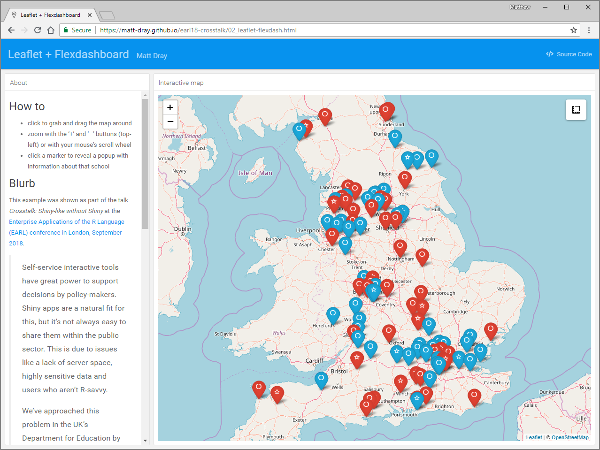
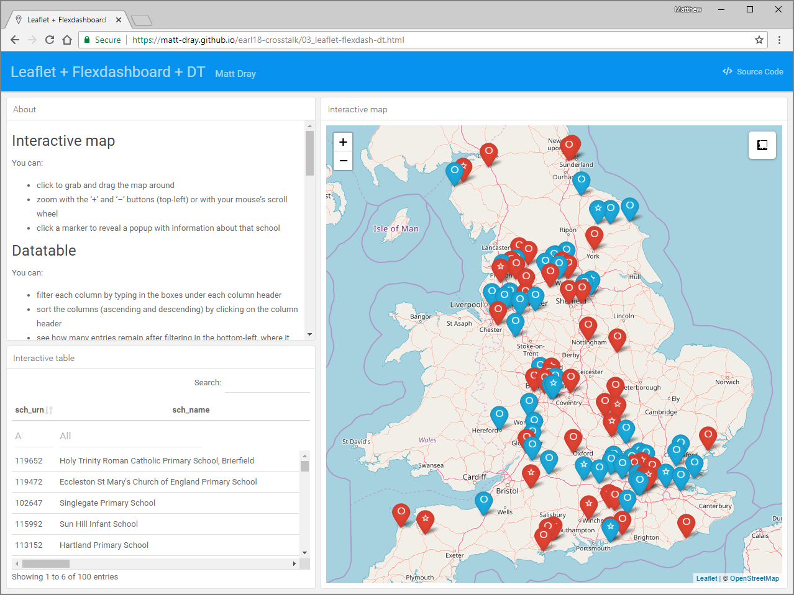
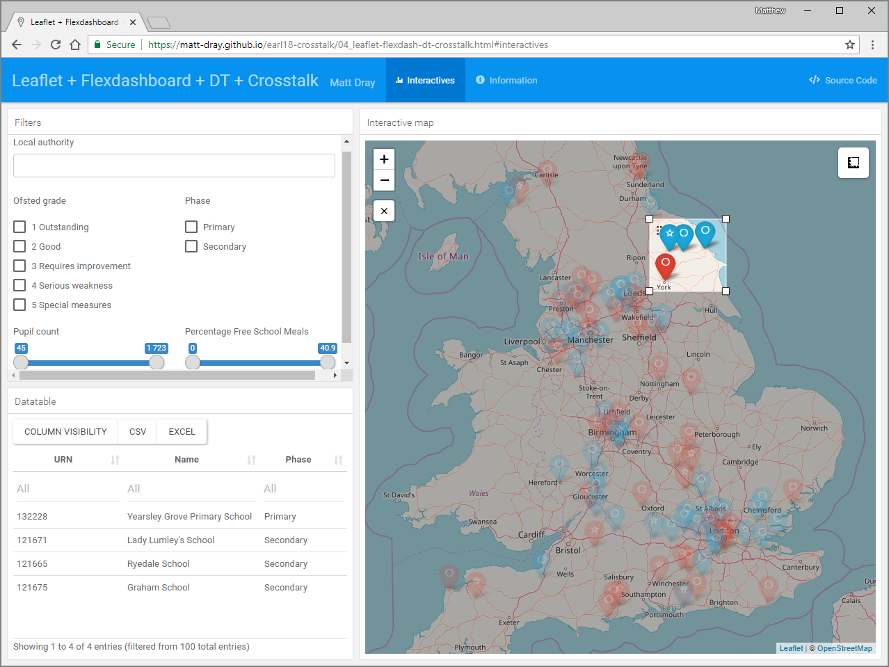
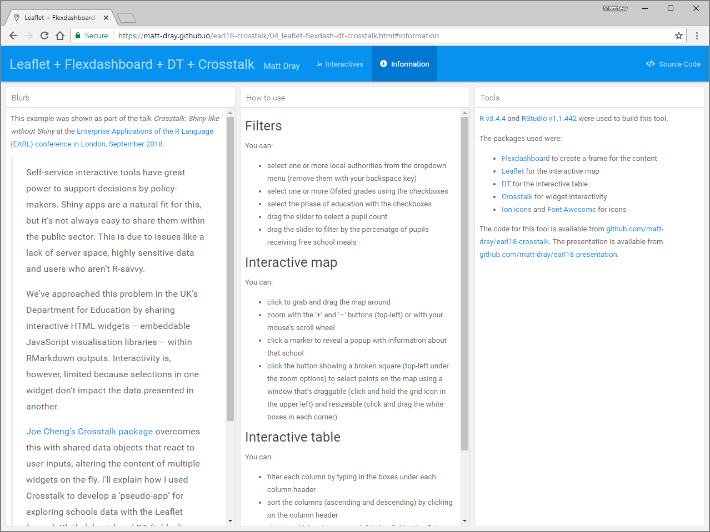

```{r setup, include=FALSE}
options(htmltools.dir.version = FALSE)
```

class: center, middle

# TL;DR

Crosstalk for small, lightweight, shareable apps

---

class: center, middle

# The ask

visualise school locations to help make a policy decision

--

quickly

--

cheaply

--

shareable

---

class: inverse, center, middle

# Solution 1

[`leaflet`](https://rstudio.github.io/leaflet/) interactive map

---

class: center, middle

.image-100[]

Demo available [here](https://matt-dray.github.io/earl18-crosstalk/01_leaflet.html)

---

class: center, middle

.image-100[]

Demo available [here](https://matt-dray.github.io/earl18-crosstalk/01_leaflet.html)

---

# Solution 1

.pull-left[

## &check;

interactive

reproducible

simple

shareable

]

--

.pull-right[

## &cross;

separate documentation

separate tabular data

rendered in-browser

]

---
class: inverse, center, middle

# Solution 2

[`leaflet`](https://rstudio.github.io/leaflet/) interactive map

in a [`flexdashboard`](https://rmarkdown.rstudio.com/flexdashboard/)

---

class: center, middle

.image-100[]

Demo available [here](https://matt-dray.github.io/earl18-crosstalk/02_leaflet-flexdash.html)

---

# Solution 2

.pull-left[

## &check;

map + documentation

user-friendly

self-service

]

--

.pull-right[

## &cross;

]

---
class: inverse, center, middle

# Solution 3

[`leaflet`](https://rstudio.github.io/leaflet/) interactive map

in a [`flexdashboard`](https://rmarkdown.rstudio.com/flexdashboard/)

with a [`DT`](https://rstudio.github.io/DT/) interactive table


---

class: center, middle

.image-100[]

Demo available [here](https://matt-dray.github.io/earl18-crosstalk/03_leaflet-flexdash-dt.html)

---

class: center, middle

.image-100[]

Demo available [here](https://matt-dray.github.io/earl18-crosstalk/03_leaflet-flexdash-dt.html)

---

# Solution 3


.pull-left[

## &check;


map + documentation + tabular

download data

]

--

.pull-right[

## &cross;

data copies

]

---
class: inverse, center, middle

# Solution 4

[`leaflet`](https://rstudio.github.io/leaflet/) interactive map

in a [`flexdashboard`](https://rmarkdown.rstudio.com/flexdashboard/)

with a [`DT`](https://rstudio.github.io/DT/) interactive table

linked with [`crosstalk`](https://rstudio.github.io/crosstalk/)

---

class: center, middle

.image-100[]

Demo available [here](https://matt-dray.github.io/earl18-crosstalk/04_leaflet-flexdash-dt-crosstalk.html)

---

class: center, middle

.image-100[]

Demo available [here](https://matt-dray.github.io/earl18-crosstalk/04_leaflet-flexdash-dt-crosstalk.html)

---

class: center, middle

.image-100[]

Demo available [here](https://matt-dray.github.io/earl18-crosstalk/04_leaflet-flexdash-dt-crosstalk.html)

---

class: center, middle

.image-100[]

Demo available [here](https://matt-dray.github.io/earl18-crosstalk/04_leaflet-flexdash-dt-crosstalk.html)

---

class: center, middle

.image-100[]

Demo available [here](https://matt-dray.github.io/earl18-crosstalk/04_leaflet-flexdash-dt-crosstalk.html)

---

# Solution 4

.pull-left[

## &check;

one data source

selections affect all widgets

filtering

]

--

.pull-right[

## &cross;

?

]

---

class: inverse, center, middle

# What's Crosstalk?

---

class: center, middle

> static html documents that do not require Shiny or any kind of server support and yet they can have interactivty between widgets 

Make your widgets friends with each other!

---

# A small code change

#### Before

```{r eval=FALSE}
data <- readRDS("data/some_data.RDS")

datatable(data)

leaflet(data) %>%  addTiles() %>% addMarkers()
```

--

#### After

```{r eval=FALSE}
data <- readRDS("data/some_data.RDS")

shared <- SharedData$new(data)  #<<

datatable(shared)

leaflet(shared) %>% addTiles() %>% addMarkers()
```

---

# Limitations

1. Authors must modify HTML widgets

2. Aggregate and summary views not yet available 

3. Crosstalk is not appropriate for large data sets

???

1. There is guidance for the tweak. 
2. Right now only linked brushing and filtering of views that show individual data points, not aggregate or summary views.
3. Depenedent on browser limitations.


---

# Resources

.pull-left[

Talk at [rstudio::conf 2017](https://www.rstudio.com/resources/videos/linking-html-widgets-with-crosstalk/)

[Documentation](https://rstudio.github.io/crosstalk/)

CRAN [package details](https://CRAN.R-project.org/package=crosstalk )

CRAN [reference manual](https://cran.r-project.org/web/packages/crosstalk/crosstalk.pdf)

Repo on [GitHub](https://github.com/rstudio/crosstalk)

]

.pull-right[


]

---
class: center, middle

# TL;DR

Insert TL;DR.

---
class: inverse, center, middle

# Contact

Matt Dray

[matthew.dray@education.gov.uk](mailto:matthew.dray@education.gov.uk)

[rostrum.blog](https://rostrum.blog) | [twitter.com/mattdray](https://www.twitter.com/mattdray) | [github.com/matt-dray](https://www.github.com/matt-dray)